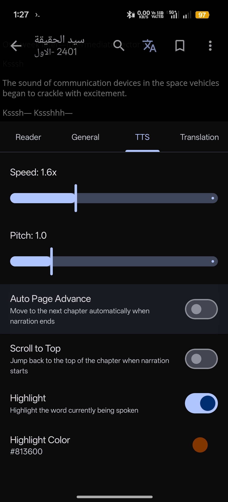
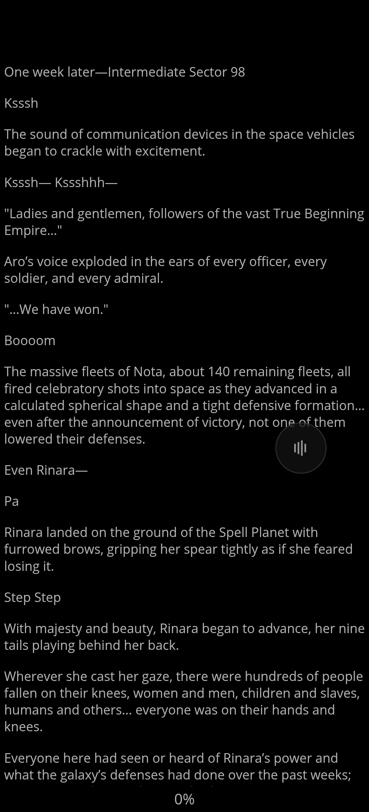
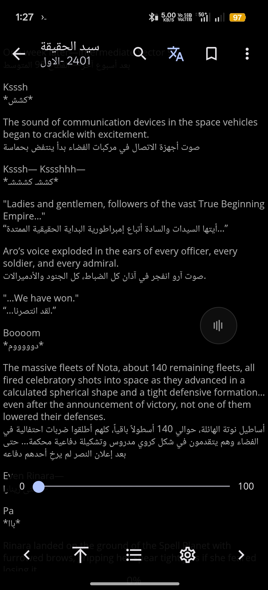

  

<h1 align="center">LNReader — Web Novel & Light Novel Reader with AI Translation (MTL) + TTS Word Highlighting</h1>

  Free, open-source Android reader for <b>light novels, webnovels, web novels, and ranobe</b> from 25+ sources — now with built-in <b>machine translation</b> in the reader and <b>NoveLA-style TTS</b> spoken-word highlighting. Read any novel in your language, or listen hands-free while the words light up.

  
  
  

## ✨ What this fork adds

### 📖 Translate light novels & webnovels in-app (MTL)

Translate the exact chapter you're reading — no copy/paste, no leaving the reader.

- **One-tap translation** from the reader's **Aa** toggle or the chapter bottom sheet
- **4 providers:** Google Gemini (BYO AI-Studio key) · any OpenAI-compatible API (OpenAI, Groq, OpenRouter, DeepSeek, Mistral…) · Google PA · **Google Free** (zero-config, no key)
- **4 reading modes:** Original only · Translated only · Parallel (original first) · Parallel (translation first)
- Editable translation prompt, regex cleanup of footnotes/URLs, source auto-detect + target language, and a model picker that accepts any model name (e.g. `gemini-3.7-flash`)
- **Offline cache** (SQLite) — translated chapters are stored locally, so revisits never re-translate

**Translation backends** — four supported, with automatic retry on rate limits (429/5xx):

| Backend | Cost | API key |
| :--- | :--- | :--- |
| Google Translate (official) | Free | Not required |
| Google Translate (free) | Free | Not required |
| Google Gemini | Free tier | Required |
| OpenAI-compatible | Varies | Required |

### 🔊 TTS with spoken-word highlighting

NoveLA-style listening: the text-to-speech engine highlights **each word as it's read aloud**, in sync with playback — with a manual hex color picker (e.g. `#FF6B6B` soft red, `#4CAF50` green) or presets, plus speed and pitch sliders.

https://github.com/user-attachments/assets/49f99dd5-0179-4138-b05b-c88b50976d11

### 📸 Screenshots

| Translated | Parallel (bilingual) | Original + TTS highlight |
| :---: | :---: | :---: |
|  |  |  |

## 📲 Download

Testing builds for all ABIs — `arm64-v8a`, `armeabi-v7a`, `x86`, `x86_64`, `universal`:
[**Latest release**](https://github.com/Vaizer0/lnreader/releases/latest)

> Package ID `com.vaizer0.LNReader` — installs **alongside** the official LNReader app without conflict.

## 📚 Core reader features

- **25+ plugin sources** for light novels & web novels (content providers are not affiliated with this project)
- Library with custom categories, **web novel trackers**, background downloads, and offline reading
- **EPUB reader**, EPUB/JSON export, backups, custom themes, TTS reader, per-page reader customization

## 🚀 Plugins

LNReader loads sources from **plugin repositories**. Add one in **Settings → Repositories**:

| Repository | Index URL |
| :--- | :--- |
| Official LNReader plugins | `https://raw.githubusercontent.com/LNReader/lnreader-plugins/plugins/v3.0.0/.dist/plugins.min.json` |
| This fork's plugins (extra sources) | `https://raw.githubusercontent.com/Vaizer0/lnreader-plugins/plugins/v3.0.0/.dist/plugins.min.json` |

This fork's repository adds the **Truth Novel** source (*Lord of the Truth* — https://truthnovel.top/), kept updated and ideal for reading with in-app translation. Plugin requests live at [lnreader-plugins](https://github.com/lnreader/lnreader-plugins) (official) and [Vaizer0/lnreader-plugins](https://github.com/Vaizer0/lnreader-plugins) (this fork); content providers are not affiliated with this project.

## 🤝 Upstream & license

This repository is a **fork of [lnreader/lnreader](https://github.com/lnreader/lnreader)** extended with in-app AI translation and spoken-word TTS highlighting. Contributing: see [CONTRIBUTING.md](./CONTRIBUTING.md). Code is licensed under [MIT](LICENSE).